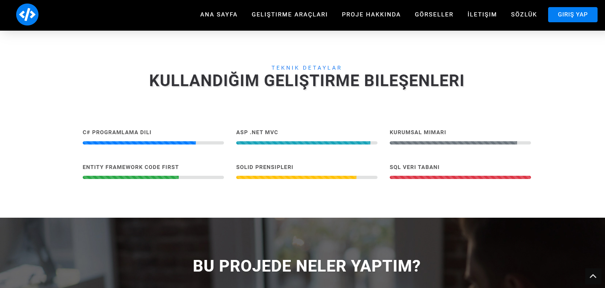

# MvcCamp Project

## Overview
Welcome to the **MvcCamp Project**! This project leverages the power of the ASP.NET MVC framework to create a dynamic web application with different user roles, including admin, author admin, and showcase panels. Our application follows a robust N-Tier Architecture, utilizing Entity Framework and LINQ for database operations. To enhance user experience, we have incorporated modern web technologies such as HTML, CSS, Bootstrap, JavaScript, and AJAX. Additionally, Sweet Alert has been integrated for notifications and user interactions. We use MSSQL as our database and adhere to SOLID principles to ensure clean and sustainable code.

## Features
- **ASP.NET MVC**: Utilized for structuring the web application.
- **N-Tier Architecture**: Ensures a modular and maintainable codebase.
- **MSSQL**: The database management system used for storing and managing data.
- **Frontend Technologies**: HTML, CSS, Bootstrap for responsive and aesthetic UI design.
- **JavaScript & AJAX**: For dynamic content loading and interactive features.
- **Entity Framework & LINQ**: Simplifying data access and manipulation.
- **Sweet Alert**: Integrated for better user notifications and interactions.
- **Code First Migration**: Facilitates database schema evolution.
- **SOLID Principles**: Ensures maintainable, scalable, and clean code.

## Technologies Used
- **ASP.NET MVC**
- **N-Tier Architecture**
- **MSSQL**
- **HTML, CSS, Bootstrap**
- **JavaScript**
- **AJAX**
- **Entity Framework**
- **LINQ**
- **Sweet Alert**
## Screenshots
Here are some screenshots showcasing the application:

### Admin Panel

### Author Admin Panel

### Showcase Panel

### Others  

